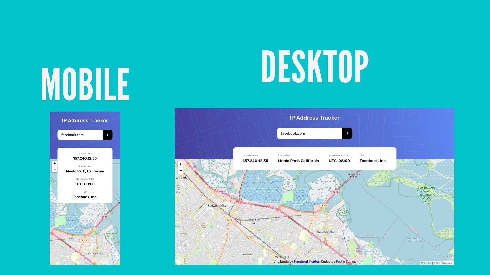

# Frontend Mentor - IP address tracker solution

This is a solution to the [IP address tracker challenge on Frontend Mentor](https://www.frontendmentor.io/challenges/ip-address-tracker-I8-0yYAH0). Frontend Mentor challenges help you improve your coding skills by building realistic projects. 

## Table of contents

- [Overview](#overview)
  - [The challenge](#the-challenge)
  - [Screenshots](#screenshots)
  - [Links](#links)
- [My process](#my-process)
  - [Built with](#built-with)
  - [What I learned](#what-i-learned)
  - [Continued development](#continued-development)
  - [Useful resources](#useful-resources)
- [Author](#author)

## Overview

### The challenge

Users should be able to:

- View the optimal layout for each page depending on their device's screen size
- See hover states for all interactive elements on the page
- See their own IP address on the map on the initial page load
- Search for any IP addresses or domains and see the key information and location

### Screenshots

### Links

- Solution URL: [Frontend Mentor](https://www.frontendmentor.io/solutions/ip-address-tracker-with-proxy-backend-using-express-A8R0-uuCGw)
- Live Site URL: [Github PAges](https://pedrohsouza.github.io/ip-address-tracker/)

## My process

### Built with

- Semantic HTML5 markup
- CSS custom properties
- Flexbox
- Mobile-first workflow
- Vanilla Javascript
- Fetch API
- [Leaflet](https://leafletjs.com/) Library
- [Ipgeolocation API](https://ipgeolocation.io)
- [Express.js](https://expressjs.com/pt-br/) for the [proxy/cache backend](https://github.com/pedrohsouza/ip-address-tracker-backend)

### What I learned

Since I needed to use an API key to the geolocation API, I decided to divide the project in two (frontend and backend), that way I could hide my API key and at the same time I could implement a rate/caching system to have more control over the access to the API through my API key.

The backend half of the project can be found [here](https://github.com/pedrohsouza/ip-address-tracker-backend).

To see how you can add code snippets, see below:

### Continued development

I'd like to add some error handling in the future and make some improvements in the UI.

### Useful resources

- [Regextester](https://www.regextester.com/104038) - An easy way to test regular expressions. I used it to validate ipv4/6 before sending the data to the backend.
- [The Coding Train](https://www.youtube.com/watch?v=17UVejOw3zA&list=PLRqwX-V7Uu6YxDKpFzf_2D84p0cyk4T7X&index=19) - How to hide API keys.

## Author

- Github - [@pedrohsouza](https://github.com/pedrohsouza)
- Frontend Mentor - [@pedrohsouza](https://www.frontendmentor.io/profile/pedrohsouza)
